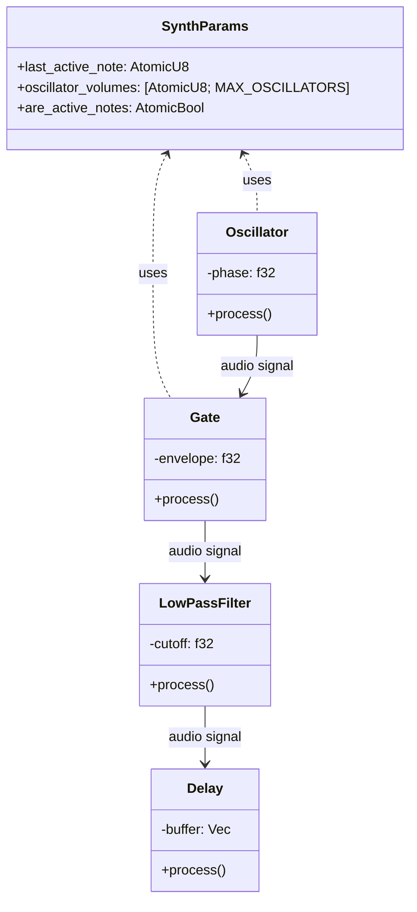

# Rust Synthesizer Documentation

## Project Purpose
Digital audio synthesizer built in Rust using CPAL for low-latency audio I/O and MIDIR for MIDI input handling. Provides basic subtractive synthesis capabilities with oscillator, envelope, filter, and delay effects.

## Dependencies
- **cpal 0.16.0**: Cross-platform audio I/O library
- **midir 0.10**: MIDI input handling

## Architecture Diagrams

### Signal Flow

### Module Relationships

## Code Patterns
- **DSP Implementations**: Sample-based processing in AudioModule trait
- **Threading Model**: Atomic parameters shared between audio thread and MIDI thread

## Module Specifications

### Oscillator
- Generates sine waves based on MIDI input
- Supports multiple oscillators with individual volume control
- Implements phase accumulation for waveform generation

### Gate (Envelope Generator)
- ADSR envelope controller
- State machine implementation (Attack/Decay/Sustain/Release)
- Modulates amplitude based on note activity

### Delay
- Basic delay effect with feedback control
- Circular buffer implementation
- Wet/dry mix control

## Performance Characteristics
- Real-time audio processing at 44.1kHz sample rate
- Lock-free parameter sharing using atomics
- Single audio processing thread

## Improvement Opportunities
1. Add additional waveform types (square, saw, triangle)
2. Implement velocity sensitivity
3. Add filter envelope modulation
4. Improve delay implementation with interpolation
5. Add polyphonic voice support